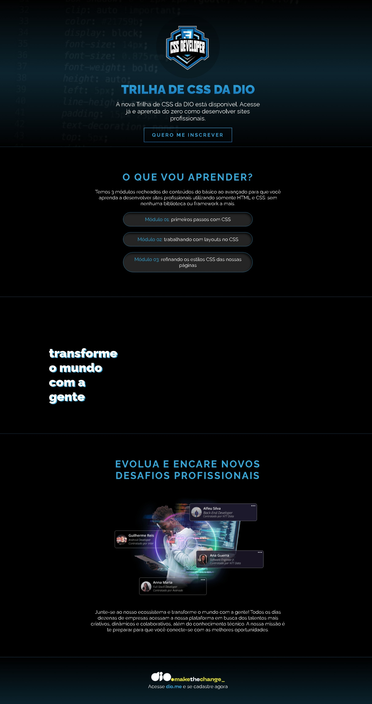

# 🚀 Trilha de CSS - DIO

Bem-vindo(a) ao projeto **Trilha de CSS da DIO**! 🎉

Este projeto faz parte da trilha de estudos de CSS da **[DIO](https://dio.me)**, onde você aprenderá a desenvolver **sites profissionais** utilizando apenas **HTML** e **CSS**.

## 📚 Conteúdos

A trilha de CSS é composta por **3 módulos** com conteúdos que vão desde o básico até o avançado:

1. **Módulo 01:** Primeiros passos com CSS 👣
2. **Módulo 02:** Trabalhando com layouts no CSS 🖼️
3. **Módulo 03:** Refinando os estilos CSS das nossas páginas 🎨

## ✨ O que você vai aprender?

- Como estilizar páginas web com CSS 🖌️
- Criação de layouts responsivos e flexíveis 📐
- Técnicas avançadas de refinamento de estilo 🎯

## 🌟 Transforme o mundo com a gente!

Junte-se ao nosso ecossistema e evolua na sua carreira! 💼 A DIO oferece uma plataforma onde empresas buscam talentos criativos e capacitados como você. 

## 🛠️ Tecnologias Utilizadas

- **HTML5** 
- **CSS3**

## 📸 Captura de Tela

## Como Executar o Projeto Localmente 🖥️

Para executar o projeto localmente, siga estas etapas:

1. Clone o repositório do projeto para sua máquina local.
2. Navegue até a pasta do projeto no terminal.
3. Instale as dependências do projeto executando `npm install`.
4. Inicie o servidor de desenvolvimento com `npm run dev`.

O projeto agora será disponibilizado no navegador local, permitindo visualizar e testar as funcionalidades em um ambiente de desenvolvimento.

## Contribuições🤝

Contribuições são bem-vindas Se você encontrar um bug, tiver uma sugestão de melhoria ou quiser adicionar uma nova funcionalidade, sinta-se à vontade para criar um issue ou pull request. Siga estas etapas:

1. Faça um fork do repositório.
2. Crie um novo branch com sua contribuição (`git checkout -b feature/minha-contribuicao`).
3. Faça commit das suas alterações (`git commit -am 'Adiciona minha contribuição'`).
4. Faça push para o branch (`git push origin feature/minha-contribuicao`).
5. Abra um Pull Request.

## Suporte ⚙

Se você encontrar algum problema ou tiver dúvidas sobre o uso deste projeto, por favor, abra um issue para discussão.

Desenvolvido com ❤️ por Amadeo Bon para contribuir com a comunidade. Boa navegação!
